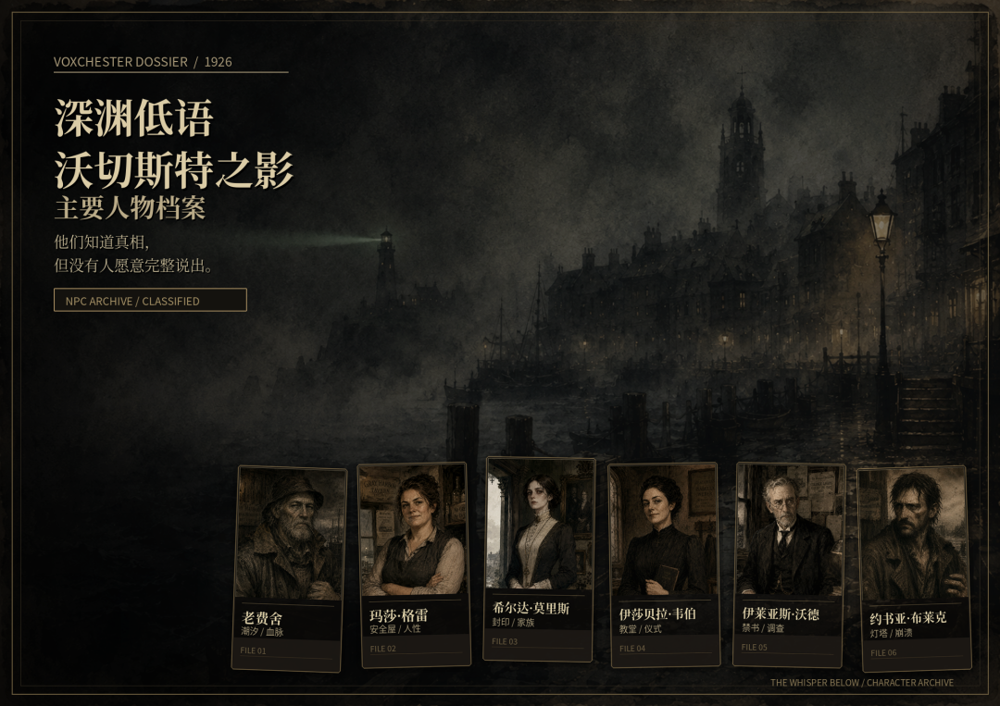

# 深渊低语：沃切斯特之影

*Abyssal Whispers: Shadow of Voxchester*

---

<div align="center">



**"第十三声钟响的那天晚上，我没有离开沃切斯特。"**

*不是我不肯走。是这个城镇不允许我离开。*

[在线游玩 ▶](https://baliujunan.github.io/abyssal-whispers/) &nbsp;·&nbsp; [如何开始](#快速开始) &nbsp;·&nbsp; [游戏特色](#游戏特色) &nbsp;·&nbsp; [技术档案](#技术档案)

</div>

---

## 快速开始

```bash
# 方式一：直接打开（推荐 Chrome / Edge）
双击 index.html

# 方式二：本地服务器
python -m http.server 8080
# 然后访问 http://localhost:8080
```

- ✅ 无需安装任何依赖
- ✅ 完全离线可玩，打开即玩
- 🖱️ 手机 / 平板 / 桌面均适配
- 🔊 **首次进入请佩戴耳机** — 音频体验是沉浸感的关键

---

## 游戏特色

### 一句话概括

> **一个用 600+ 个事件、36 种行为结局、51 段原创音频和一套会对你撒谎的界面，讲述你在一座不该存在的城镇上活过、死过、再回来的故事。**

### 核心数据一览

| 维度 | 数据 | 说明 |
|------|------|------|
| 独立事件 | **600+ 个** | 覆盖探索/人性/超自然/NPC/区域深层/Meta/资源 |
| 行为结局 | **36 条** | 由你的选择模式触发，非预设分支 |
| 主线/隐藏结局 | **11+ 条** | 含打破第四面墙的 Meta 结局 |
| NPC | **8 位 × 6 层对话** | 每位 NPC 有完整的信任进化树 |
| 可探索区域 | **9 个** | 从镇中心到深渊墓穴，危险度递进 |
| 物品 | **79 种** | 全部有使用效果，含 2 家可购买商店 |
| 事件链 | **7 条** | 顺序推进的多阶段调查链 |
| 限时选择 | **4 个关键节点** | 时间替你做出决定 |
| 音频素材 | **51 段 WAV** | 覆盖 10 大类听觉场景 |
| 成就 | **23 个** | 探索/结局/挑战/隐藏 |
| 存档槽位 | **6 个** | 3 自动轮转 + 3 手动管理 |
| WebP 素材 | **210 张** | 100% 使用率 |

**预计完整体验：20-40 小时 | 三周目入坑，十周目见真结局**

---

## 你踏入了什么

1926 年深秋。马萨诸塞州东南海岸。一座叫**沃切斯特**的港口城市。

你来这里的原因不重要——失踪案委托、学术邀请、或者只是在错误的时间出现在了错误的地点。

重要的是：**一旦踏入这座城，你就再也无法轻易离开。**

### 这座城不对劲

教堂的钟声每天响 **十三下**。码头的潮汐与任何时刻表都不吻合。公告栏上贴着你的失踪告示——上面的照片是你，但你还没拍过那张照。

三百年前莫里斯家族在此建立了封印。三百年后，封印开始松动。

深潜者从海岸裂隙中爬出。夜魔在森林中低语。地下墓穴里传来有节奏的敲击声——仿佛某个庞然之物正在苏醒。

### 你会遇到这些人

| 角色 | 身份 | 你需要知道的 |
|------|------|-------------|
| 老费舍 | 渔夫 | 打了六十年的鱼。血管里流着不属于人类的东西。他知道的比你想象的多 |
| 玛莎·格雷 | 酒吧老板娘 | 镇上唯一不问来处的女人。吧台最右边那杯没动过的酒，她每天换一杯新的 |
| 希尔达·莫里斯 | 庄园女主人 | 封印家族最后一位直系后裔。二十八岁。已经能感觉到来自地下的拉扯 |
| 伊莎贝拉·韦伯 | 教堂执事 | 每天敲响十三下钟声的人。皮肤下偶尔能看到蠕动的纹路 |
| 伊莱亚斯·沃德 | 退休教授 | 能读不该读的文字。代价是理智以可测量速度流失 |
| 约书亚·布莱克 | 流浪汉 | 前海军陆战队员。身上的螺旋形疤痕不是战场上留下的——是在这座城留下的 |
| 汤米·陈 | 杂货店主 / 业余摄影师 | 冲洗出来的照片里总有些不该存在的影子。出于好奇心反而拍得更勤了 |
| 埃德加·洛夫克拉夫特 | 作家 | 偶尔介入调查的记录者 |

每位 NPC 有 **6 层对话树**——沉默也是一种选择。不回答玛莎的问题，她反而更信任你了。

> 第八周目的时候，老费舍会对你说：
>
> "你又来了。"
>
> 五个字。然后你会关掉浏览器，坐很久。

---

## 深渊机制

### 核心循环

```
每日行动点 → 探索 / 对话 / 调查 / 工作 / 购买 / 隐秘行动
        ↓
   触发事件（技能检定 d100）
        ↓
   HP 归零 = 死亡 → 进入下一周目
   SAN 归零 = 疯狂 → 进入下一周目
        ↓
   保留知识碎片与世界污染记录
   SAN 上限永久削减
   再次踏入沃切斯特
```

### 理智值 (SAN)：这不是血条

SAN 是你与现实之间的契约强度。数值下降时，**游戏本身开始对你撒谎：**

| SAN 区间 | 临床记录 | 游戏表现 |
|----------|---------|---------|
| **80-100** | 认知稳定 | 一切正常。你还相信自己看到的东西 |
| **60-79** | 轻度侵蚀 | 文字偶尔出现微弱阴影。你可能注意到了，也可能没有 |
| **40-59** | 感知偏移 | 叙事文本开始颤抖。按钮响应变慢。区域名称泛着不自然的光晕 |
| **20-39** | 解释权丧失 | UI 本身在对抗你。选项文字会自己改写。存档文件名变了 |
| **1-19** | 现实崩解 | 第四面墙破裂。伪造存档通知、注入虚假错误代码、篡改物品描述 |

**这不是"角色疯了所以看到幻觉"的廉价处理。是界面本身成为恐怖载体。**

### 经济系统：金钱与购买

```
打工挣钱（2 AP → 3-12 金钱）
        ↓
前往商店（NPC 信任解锁）
        ↓
购买物资：干粮(4-5) / 绷带(3-4) / 手电筒(8) / 发光蘑菇(12)
```

| 商店 | NPC | 解锁信任 | 特色 |
|------|-----|---------|------|
| 陈氏杂货店 | 汤米·陈 | ≥0 | 基础日用品：干粮、绷带、手电筒 |
| 码头酒馆补给 | 玛莎·格雷 | ≥1 | 更便宜的补给 + 稀有物品 |

### 限时选择：时间替你做决定

某些关键时刻，你没有无限的时间犹豫。倒计时归零时，游戏会替你选择——通常是最差的那个。

| 场景 | 限时 | 默认选择 |
|------|------|---------|
| 码头仓库门后传来呼救声 | 15 秒 | 假装没听到 |
| 森林中雾气消散前选择路径 | 20 秒 | 选择安全的路 |
| 墓穴封印的声音在减弱 | 12 秒 | 继续沉默 |
| 饥饿下面对最后一份食物 | 18 秒 | 拿走食物 |

### 饥饿与安全屋

食物每日自动消耗 1 单位。光源每日自动消耗 1 级。信任≥3 的在场 NPC 每人额外消耗 0.5 食物。

```
食物 = 0 第1天:  SAN -1
食物 = 0 第2天:  HP -1，技能检定 -5
食物 = 0 第3天+: HP -2，饿死概率递增（10%+5%/天）
```

### 事件链：顺序推进的调查

7 条事件链，每条 3 个步骤，按顺序触发。完成后解锁奖励与隐藏内容。

### 28 天封印倒计时

| 时间节点 | 发生了什么 |
|----------|-----------|
| Day 1 | 钟声开始异常 |
| Day 7 | 核心 NPC 开始出现腐化征兆 |
| Day 14 | 深潜者大潮登陆 |
| Day 21 | 全城疯狂之夜 |
| Day 28 | 封印破碎 —— 最终决战 |

每次轮回都更难。SAN 上限削减 3 点。NPC 逐步识别你是重复访客。

### 结局

| 类别 | 数量 | 说明 |
|------|------|------|
| 主线结局 | 10+ 条 | 真/隐藏/好/坏/中性，根据人性值分支 |
| Meta 隐藏结局 | 1 条 | 第 600 事件尽头打破第四面墙 |
| 行为/异常结局 | **36 条** | 由行为模式触发——自残/融合/食人/背叛/救赎…… |
| 死亡终局 | 15 种 | 四段式叙事独立撰写 |

**结局 V2 人性判定**：追踪你是否救赎过 NPC、是否抵抗过腐败。温暖度足够高时，脆弱档结局会提升为高档文本。

**7 种起始职业**：记者 / 渔夫 / 学者 / 军医 / 侦探 / 牧师 / 流亡者

---

## 系统功能

| 功能 | 详情 |
|------|------|
| **🛒 商店系统** | 2 家商店，NPC 信任解锁，金钱购买物资 |
| **⏱ 限时选择** | 4 个关键节点有倒计时，超时自动选择默认选项 |
| **🔗 事件链** | 7 条顺序推进的多阶段调查链 |
| **🎵 音频系统** | 51 段 WAV，覆盖 10 大类听觉场景 |
| **⚙️ 设置面板** | 4 音量 · 字号 · SAN扭曲开关 · 突发音效 · 闪烁效果 |
| **🏆 成就系统** | 23 个成就，分进程/结局/挑战/隐藏四大类 |
| **💾 多槽位存档** | 3 自动 + 3 手动，JSON 导入/导出 |
| **⌨️ 快捷键** | 1-9选择 · Space确认 · M地图 · I物品 · J线索 |
| **📖 章节转场** | Day 4/8/15/22 触发沉浸式过渡动画 |
| **🔄 轮回继承** | 知识碎片 / 世界污染 / NPC 记忆 / 事件链进度 |
| **♿ 无障碍** | 可关闭视觉扭曲 · 字号可放大 · reduced-motion 支持 |

---

## 听觉体验

> **推荐佩戴耳机游玩。音频不只是装饰——它是恐惧的一部分。**

覆盖：区域氛围(9区×日夜) / 第十三声钟(5变体) / SAN分层(6段) / 死亡变体(3种) / 轮回(3段) / 安全屋(5阶段) / UI反馈(8种) / 检定(4种)

---

## 来自沃切斯特的声音

> **推荐 ★ 32 小时 | 深海潜航者**
>
> 然后 SAN 掉到了 60 以下。游戏开始对我撒谎了。不是"角色看到幻觉"那种廉价处理——是 UI 本身在撒谎。

> **推荐 ★ 52 小时 / 全结局 | 沃切斯特档案员**
>
> 第一周目只是一个教程。真正的游戏从第三周目开始。第十周目我才触发了真结局。值得吗？值得。

---

## 在线体验

**[GitHub Pages](https://baliujunan.github.io/abyssal-whispers/)** — 浏览器直接打开即可游玩

---

## 许可

**Copyright © 2024-2026 BALIUJUNAN. All Rights Reserved.**

本游戏受 [CC BY-NC-ND 4.0](LICENSE) 许可证保护。

- ✅ **允许**：查看、下载、非商业分享（需注明出处）
- ❌ **禁止**：商业使用、修改、再分发修改版、移除版权声明

---

## 技术档案

> 以下内容面向开发者与对交互叙事工程感兴趣的研究者。

### 架构

```
React 18 (CDN) + useReducer 全状态驱动
    → Lazy-clone Reducer（嵌套对象按需浅拷贝）
    → {GD} Context 单例（游戏数据全局访问）
    → JSON/JS 配置驱动（事件/结局/效果/NPC/商店 全部数据化）
    → 单文件构建产物 index.html (~1.56 MB, 完全离线)
```

### 核心模块

| 模块 | 职责 |
|------|------|
| **V2 事件调度器** | 30+ 触发条件、预算控制、章节约束、事件链推进 |
| **死亡系统** | 五层推理链：事件指定→标签匹配→模式分类→区域启发式→默认兜底 |
| **UI 腐败** | 6 层递进渲染 clean→fogged→repetitive→contradictory→hostile→abyssal |
| **感知腐败** | 5 维度(焦点/边缘/音频/输入/文本) × 3-4 级独立计算 |
| **商店系统** | NPC 信任解锁、金钱交易、物品入背包 |
| **限时选择** | TimedChoiceBar 倒计时组件 + CHOICE_TIMEOUT 自动选择 |
| **记忆退化** | 区域名称随时间/SAN/循环次数变形，9区域×5级 |
| **结局 V2** | 人性评分 + NPC救赎追踪 + 温暖度修正 |
| **轮回系统** | 跨周目状态传递：知识/污染/NPC记忆/事件链进度 |
| **存档系统** | 6 槽位(3A+3M) + 版本兼容 + JSON导入导出 |

### 事件调度器决策链

```
章节约束 → 区域过滤 → 触发条件评估(30+种) → 日预算控制 → 冷却追踪 → 事件链推进 → 加权随机抽取
```

### 数据驱动

```
src/data/                    # 600+ 事件（12 文件）
src/game_data.json           # 世界规则/NPC/道具/区域/商店（~608KB）
src/reducers/                # 18 个 reducer 模块
```

新增事件不需要改动任何 reducer 代码。

### UI 视觉架构

**四层字体**：Noto Serif SC(叙事) / Noto Sans SC(界面) / JetBrains Mono(系统) / LXGW WenKai(笔记)

**腐败六层**：阴影偏移 → 闪烁+色漂移 → 抖动+文字改写 → 强烈震颤+删除线 → 持续故障

**感知五维**：文本不可靠 / 焦点失真 / 边缘清晰度 / 输入抵抗 / 音频入侵

### 项目结构

```
COC/
├── index.html              # 构建产物（~1.56MB，可直接运行）
├── build.py                # Python 构建脚本
├── assets/webp/            # 210 张 WebP 素材
├── audio/                  # 51 个 WAV 文件
├── src/
│   ├── app.jsx             # 主逻辑 + React 组件
│   ├── game_data.json      # 核心数据（~608KB）
│   ├── data/events_*.js    # 600+ 扩展事件
│   └── reducers/           # 18 个状态管理模块
└── test_systems.py         # 自动化测试（143+ 项）
```
